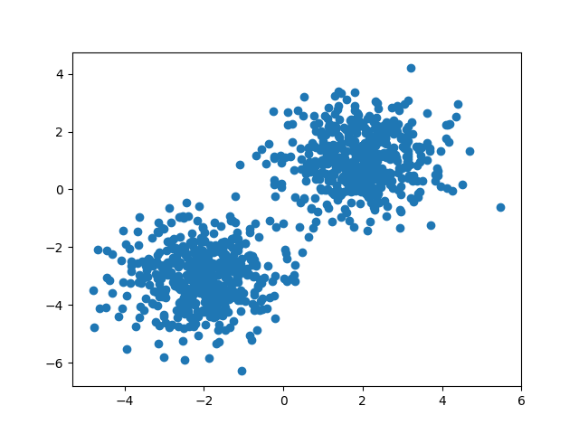
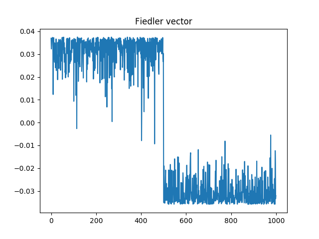
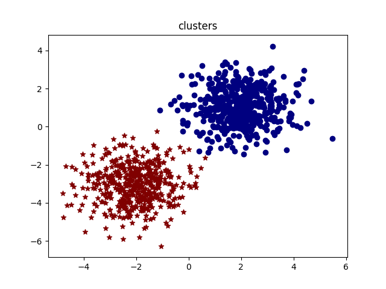
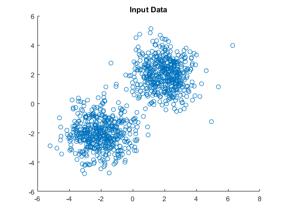
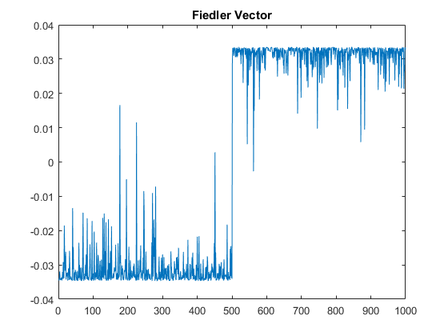
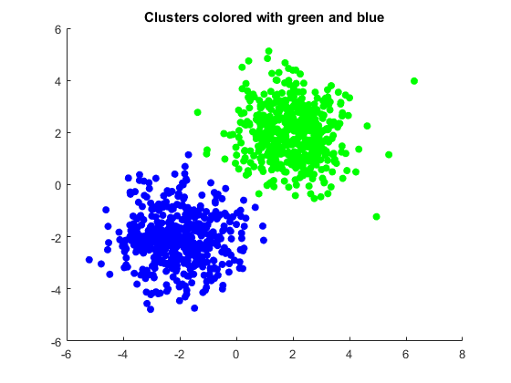

# PyTorch-Spectral-clustering
[Under development]- Implementation of various methods for dimensionality reduction and spectral clustering with PyTorch and Matlab equivalent code.
 
Sample Images from PyTorch code
 

 

Sample Images from Matlab equivalent code

 

   
 
 
## Goal
Use with Pytorch for general purpose computations by implementing some very elegant methods for dimensionality reduction and graph spectral clustering. 
 

## Description
In this repo, I am using PyTorch in order to implement various methods for dimensionality reduction and spectral clustering.
At the moment, I have added Diffusion Maps [1] and I am working on the methods presented in the following list (as well as some other that I will add in the future).  
 

Except from some examples based on 2-D Gaussian distributed clusters I will also add examples with face, food, imagenet categories etc.
 

## Prerequisites
In order to run these examples you need to have Pytorch installed in your system. I worked with Anaconda2 and Pytorch: 

    pytorch                   0.2.0           py27hc03bea1_4cu80  [cuda80]  soumith
 
(you can verify your pytorch installation by running 

    conda list | grep pytorch

Feel free to contact me for suggestions, comments etc.

### References
 - [1]  Diffusion maps, RR Coifman, S Lafon, Applied and computational harmonic analysis 21 (1), 5-30   
 - [2]  Jianbo Shi and Jitendra Malik (1997): "Normalized Cuts and Image Segmentation", IEEE Conference on Computer Vision and Pattern Recognition, pp 731–737  
 - [3] Andrew Y. Ng, Michael I. Jordan, and Yair Weiss. 2001. On spectral clustering: analysis and an algorithm. In Proceedings of the 14th International Conference on Neural Information Processing Systems: Natural and Synthetic (NIPS'01), T. G. Dietterich, S. Becker, and Z. Ghahramani (Eds.). MIT Press, Cambridge, MA, USA, 849-856. 
 - [4] ...
 
